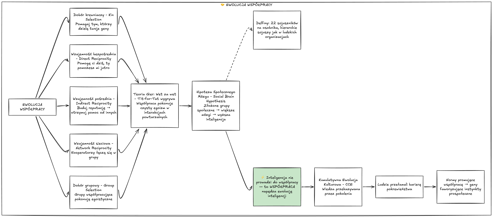
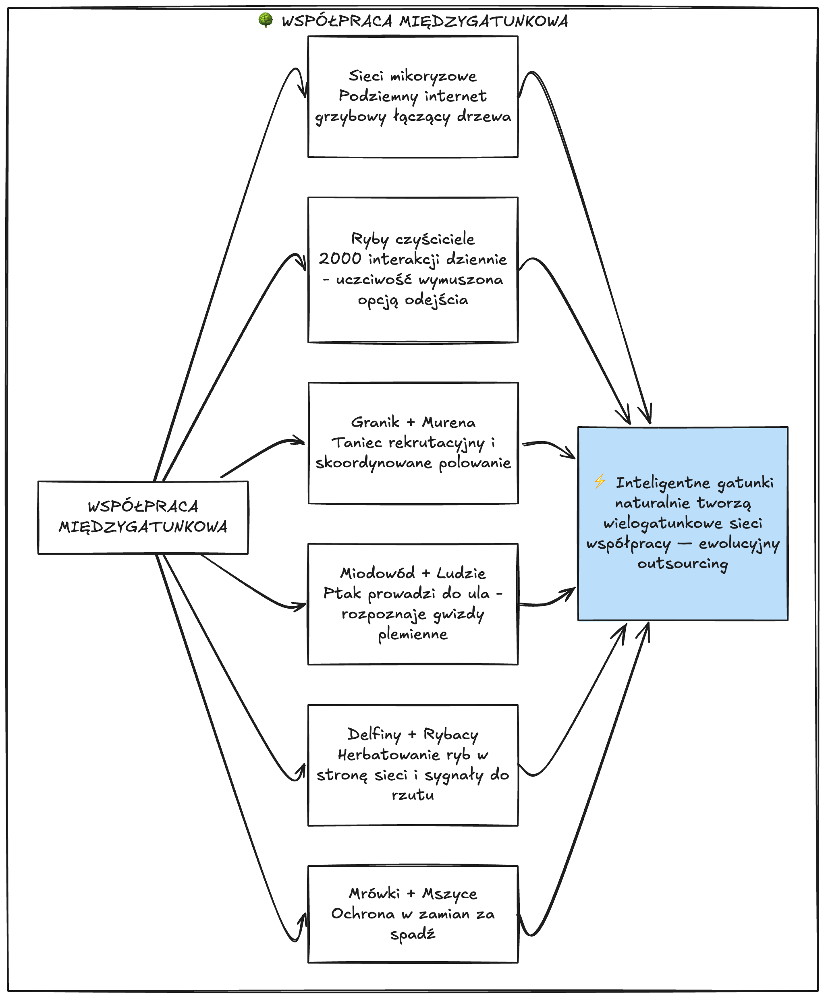
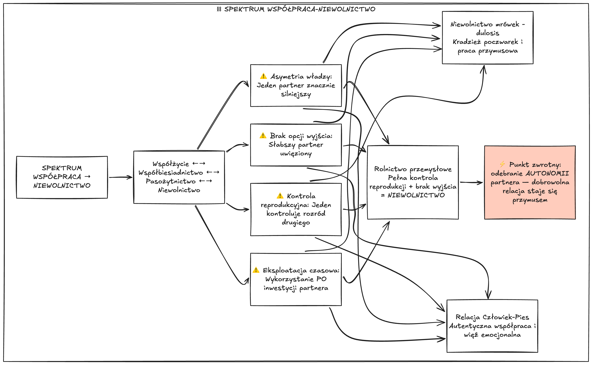
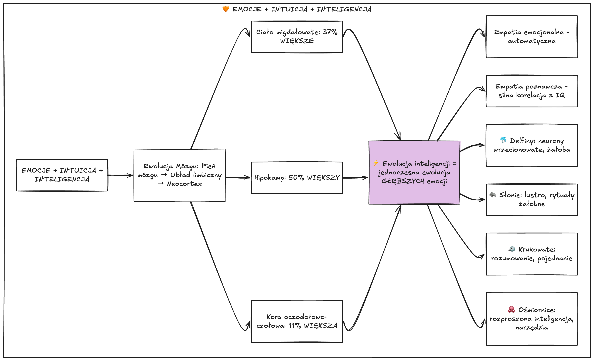
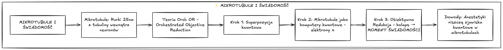
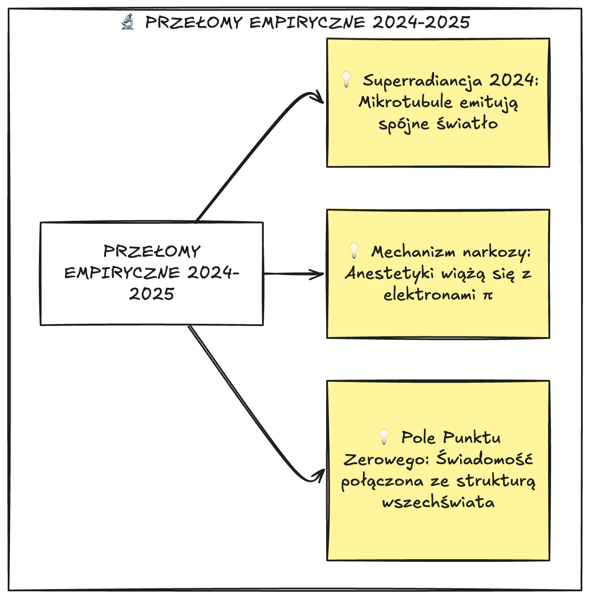
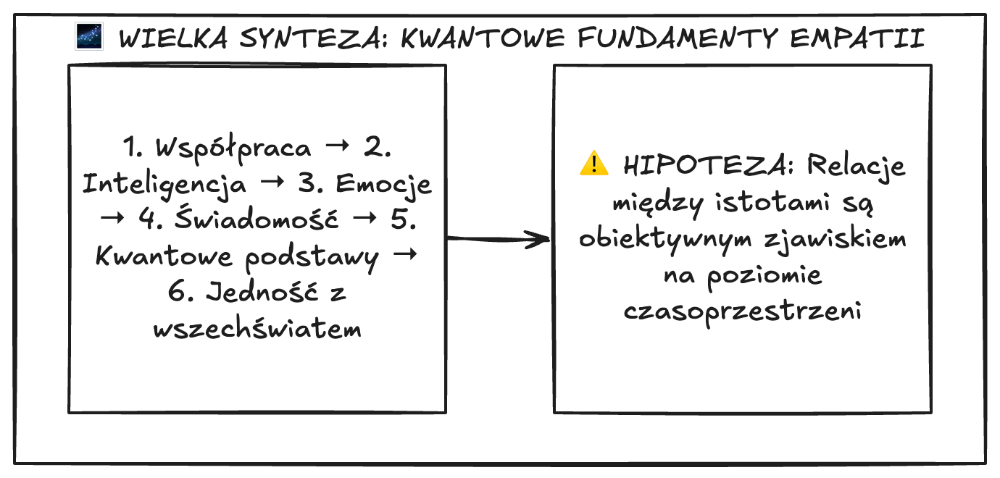
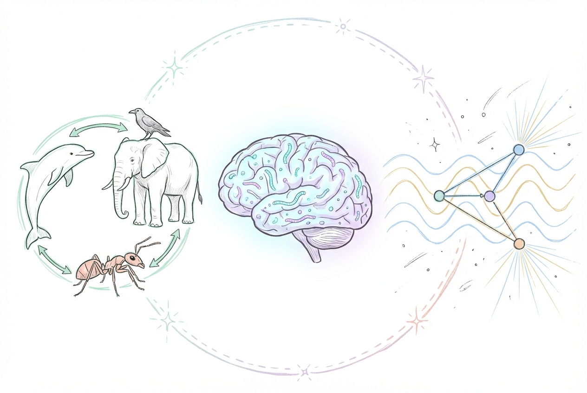
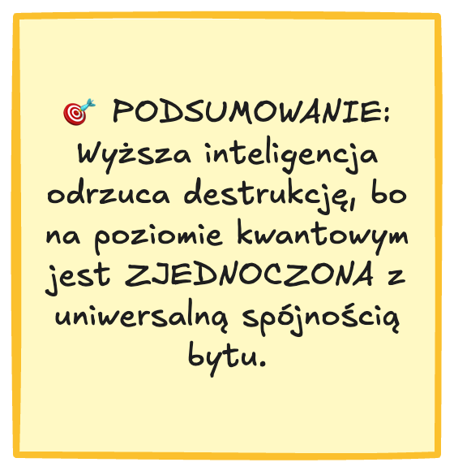

## 🚀 Intro

Zaczęło się od prostego pytania, które nie dawało mi spokoju.

Siedziałem pewnego wieczoru nad artykułami o delfinach współpracujących z rybakami w Brazylii, o słoniach wracających do ciał zmarłych towarzyszy, o kruczej inteligencji porównywalnej z małpami — i nagle uderzyła mnie myśl: **dlaczego najbardziej inteligentne istoty na tej planecie konsekwentnie wybierają budowanie zamiast niszczenia?**

Bo pomyśl — gdyby inteligencja była po prostu narzędziem do dominacji, to najsprytniejsze gatunki powinny być najskuteczniejszymi niszczycielami. Tymczasem jest dokładnie odwrotnie. Delfiny tworzą wielopoziomowe sojusze. Słonie opłakują zmarłych. Kruki planują przyszłość i godzą się po kłótniach. A ludzie — mimo wszystkich swoich wad — zbudowali cywilizację opartą na współpracy milionów obcych sobie osób.

To fascynujące. I postanowiłem pociągnąć ten wątek tak daleko, jak się da.

Ta podróż zaprowadziła mnie w miejsca, których się nie spodziewałem. Od teorii gier i ewolucji, przez neurobiologię emocji, aż po... fizykę kwantową. Tak — fizykę kwantową. Bo okazuje się, że odpowiedź na pytanie "dlaczego mądre istoty nie niszczą" może leżeć nie w psychologii czy filozofii, ale w samej strukturze rzeczywistości.

Zapraszam na głębokie nurkowanie. Będzie naukowo, ale przystępnie — każdy termin wyjaśniam od razu, a abstrakcyjne koncepty tłumaczę analogiami. Obiecuję, że nie potrzebujesz żadnej specjalistycznej wiedzy. Potrzebujesz tylko ciekawości.

---

## 📋 TL;DR

- **Współpraca to nie zaprzeczenie ewolucji** — to jej trzeci filar, obok mutacji i doboru naturalnego. Teoria gier matematycznie dowodzi, że budowanie jest bardziej opłacalne niż niszczenie.
- **Inteligencja i emocje rosną razem** — ewolucja mózgu oznaczała jednoczesny rozwój struktur emocjonalnych i poznawczych. Najbardziej inteligentne gatunki (delfiny, słonie, kruki) są też najbardziej emocjonalne.
- **Intuicja ekspercka to nie magia** — to zaawansowane przetwarzanie wzorców, które działa lepiej u bardziej inteligentnych istot.
- **Świadomość może mieć kwantowe korzenie** — teoria Orch OR Penrose'a i Hameroffa zyskała przełomowe potwierdzenia eksperymentalne w latach 2024–2025.
- **Empatia i współpraca mogą być wpisane w strukturę wszechświata** — jeśli świadomość wyrasta z koherencji kwantowej, to niszczenie relacji jest niszczeniem samej świadomości (HIPOTEZA wymagająca dalszych badań).
- **Eksploatacja to ewolucyjna anomalia** — pojawia się, gdy asymetria siły obniża koszty wyzysku, ale długoterminowo zawsze przegrywa z kooperacją.

---

## 🤝 Współpraca jako silnik ewolucji

### Mit "przetrwania najsilniejszych"

Większość z nas wyrosła z obrazem ewolucji jako krwawej areny, gdzie silniejszy pożera słabszego. "Prawo dżungli". "Przetrwanie najsilniejszych". Brzmi znajomo?

Tymczasem to jedno z największych nieporozumień w historii nauki. Słynne hasło *survival of the fittest* nie pochodzi nawet od Karola Darwina — wymyślił je filozof Herbert Spencer, i to w kontekście ekonomicznym, nie biologicznym. Darwin mówił o "doborze naturalnym", co jest czymś zupełnie innym niż "prawo silniejszego". Słowo *fittest* nie oznacza "najsilniejszy" — oznacza "najlepiej dopasowany" do środowiska. A jak się okazuje, najlepiej dopasowane są często te istoty, które potrafią współpracować.

Już na początku XX wieku rosyjski przyrodnik Piotr Kropotkin, prowadząc badania na surowej Syberii, zauważył coś zaskakującego: gatunki żyjące w ekstremalnie trudnych warunkach **nie wyniszczały się nawzajem**. Wręcz przeciwnie — wykazywały silną tendencję do wzajemnej pomocy. Opisał to w przełomowej książce *Pomoc wzajemna jako czynnik ewolucji* (1902), która na ponad sto lat wyprzedziła swoją epokę.

Współczesna biologia potwierdza intuicję Kropotkina: **współpraca to trzeci fundamentalny filar ewolucji**, działający równolegle do mutacji i doboru naturalnego. Nie jest wyjątkiem od reguły — jest regułą.

### Pięć mechanizmów kooperacji

Naukowcy zidentyfikowali pięć głównych sposobów, w jakie ewolucja "wynalazła" współpracę. Każdy z nich działa w nieco inny sposób, ale wszystkie prowadzą do tego samego wniosku: pomaganie się opłaca.

**1. Dobór pokrewny** — pomagamy tym, którzy dzielą z nami geny. Dlatego pszczoły poświęcają się dla ula — chroniąc królową, chronią kopie własnych genów. Matematycznie ujmuje to **reguła Hamiltona**: altruizm opłaca się, gdy koszt dla dawcy jest mniejszy niż korzyść dla biorcy pomnożona przez stopień pokrewieństwa. To eleganckie równanie wyjaśnia, dlaczego matka rzuci się w ogień za dziecko, ale niekoniecznie za obcego.

**2. Bezpośrednia wzajemność** — "ja pomogę tobie dziś, ty pomożesz mi jutro". Działa, gdy te same osobniki spotykają się wielokrotnie. Wyobraź sobie to jak konto w banku przysług — wpłacasz dziś, wypłacasz jutro.

**3. Pośrednia wzajemność** — budowanie reputacji. Kto pomaga innym, zyskuje dobrą opinię i sam otrzymuje pomoc od osób trzecich. To jak system ocen na Allegro — pomagasz obcym, bo inni obcy widzą twoją historię i chętniej ci zaufają.

**4. Wzajemność sieciowa** — współpracownicy grupują się razem w przestrzeni, tworząc "wyspy kooperacji" odporne na oszustów. Jak dzielnice, w których sąsiedzi się znają i pilnują — oszust szybko zostaje zidentyfikowany i wykluczony.

**5. Dobór grupowy** — grupy złożone ze współpracowników pokonują grupy egoistyczne w rywalizacji międzygrupowej. Drużyna, w której każdy gra dla zespołu, wygrywa z drużyną indywidualistów — nawet jeśli poszczególni indywidualiści są "silniejsi".

### Teoria gier: matematyczny dowód na opłacalność współpracy

**Teoria gier** to matematyczna metoda analizy strategicznych decyzji — brzmi sucho, ale wyniki są fascynujące.

Robert Axelrod zorganizował słynny turniej komputerowy, w którym różne strategie rywalizowały ze sobą w powtarzanym **dylemacie więźnia** (sytuacji, gdzie dwóch graczy musi zdecydować: współpracować czy zdradzić). Zgłoszono dziesiątki wyrafinowanych algorytmów — skomplikowane strategie z pamięcią, blefowaniem, losowymi zdradami.

> **Zwyciężyła najprostsza strategia: "wet za wet"** (*tit-for-tat*). Zacznij od współpracy. Potem rób to, co zrobił twój partner w poprzedniej rundzie. Ta strategia wygrywała, bo jest **miła** (nigdy nie atakuje pierwsza), **stanowcza** (natychmiast karze zdradę) i **wybaczająca** (wraca do współpracy, gdy partner przestaje oszukiwać).

Zastanówmy się, co to oznacza. Matematyka — najchłodniejsza z nauk — mówi nam, że **bycie miłym, ale stanowczym i wybaczającym to optymalna strategia**. Nie naiwność. Nie bezwzględność. Coś pomiędzy. To nie jest moralizowanie — to czysty rachunek prawdopodobieństwa.

Co ciekawe, badania nad ludzkim mózgiem pokazują, że naturalną, intuicyjną reakcją wielu ludzi jest właśnie współpraca — to dopiero dłuższe zastanowienie skłania niektórych do egoizmu, jeśli wydaje się on w danym momencie bardziej opłacalny. Nasz mózg domyślnie "ustawiony jest" na kooperację.

Ważne zastrzeżenie: współpraca opłaca się głównie wtedy, gdy **interakcje się powtarzają**. W jednorazowym spotkaniu z nieznajomym oszustwo może być bardziej "opłacalne". Dlatego współpraca kwitnie w społecznościach, gdzie ludzie (lub zwierzęta) spotykają się regularnie — i dlatego anonimowość jest wrogiem kooperacji.

### Hipoteza społecznego mózgu

Jednym z najważniejszych odkryć ostatnich dekad jest **hipoteza społecznego mózgu**: największe mózgi i najbardziej zaawansowane zdolności umysłowe występują u gatunków żyjących w złożonych grupach społecznych.

Trzy grupy ssaków osiągnęły szczyty rozwoju mózgu: **naczelne** (w tym ludzie), **słonie** i **walenie** (delfiny i wieloryby). Co je łączy? Życie w złożonych grupach społecznych wymagających ciągłej współpracy, negocjacji i budowania sojuszy.

Delfiny butlonoste w Shark Bay w Australii tworzą sojusze na dwóch–trzech poziomach hierarchii — złożoność porównywalna z ludzkimi organizacjami korporacyjnymi. Pojedynczy delfin utrzymuje relacje średnio z 22 sojusznikami. Badania trwające dekady pokazały, że **siła więzi społecznych przewiduje sukces reprodukcyjny** — samce z najsilniejszymi sojuszami mają najwięcej potomstwa. Nie najsilniejsze fizycznie. Nie najszybsze. Te z najlepszymi relacjami.

I tu dochodzimy do kluczowego wniosku, który odwraca potoczne myślenie:

> **To nie inteligencja prowadzi do współpracy — to współpraca napędza rozwój inteligencji.** Mózg rośnie, bo trzeba zapamiętywać sojuszników, rozumieć relacje między innymi i przewidywać zachowania społeczne. Życie w grupie to najlepszy trening dla mózgu.

### Kumulatywna ewolucja kulturowa — ludzki turbo-dopalacz

U większości ssaków współpraca ogranicza się do bliskich krewnych. Gatunek ludzki przełamał tę barierę dzięki **kumulatywnej ewolucji kulturowej** (CCE) — zdolności do przekazywania wiedzy, wynalazków i norm społecznych z pokolenia na pokolenie.

Wyobraź sobie to tak: żaden pojedynczy człowiek, bez względu na to jak genialny, nie byłby w stanie samodzielnie wynaleźć, zaprojektować i zbudować kajaka używanego przez rdzennych mieszkańców Arktyki. Ten kajak to produkt setek pokoleń drobnych ulepszeń, przekazywanych z ojca na syna. Każde pokolenie dodawało odrobinę — lepszy kształt kadłuba, skuteczniejsze uszczelnienie, wygodniejsze siedzisko. Sukces naszego gatunku opiera się nie na indywidualnym geniuszu, ale na zdolności do **kumulowania wiedzy**.

Ta ewolucja kulturowa stworzyła nowe środowisko dla doboru naturalnego: społeczności nagradzające kooperację zyskały ogromną przewagę nad grupami egoistów. Dobór naturalny zaczął faworyzować geny odpowiedzialne za prospołeczne instynkty — zdolność do empatii, odczuwanie wstydu i winy za złamanie zasad grupowych, potrzebę przynależności.

| Kryterium | Czysty darwinizm (egoizm) | Przetrwanie najprzyjaźniejszych (kooperacja) |
|-----------|--------------------------|-----------------------------------------------|
| **Zasięg współpracy** | Tylko bliscy krewni | Ogromne grupy niespokrewnionych jednostek |
| **Mechanizm adaptacji** | Powolna ewolucja genetyczna | Szybka ewolucja kulturowa — przekazywanie wiedzy |
| **Podejście do słabszych** | Silniejsi odbierają zasoby | Ochrona słabszych przez systemy moralne |
| **Wynik dla gatunku** | Ograniczony rozwój | Globalna dominacja, cywilizacja, loty kosmiczne |

---

## 🌳 Współpraca ponad granicami gatunków

Skoro współpraca jest tak potężnym narzędziem ewolucji, to czy działa tylko w obrębie jednego gatunku? Absolutnie nie. I tu zaczyna się naprawdę fascynująca część.

Zamiast ewoluować przez miliony lat, żeby wykształcić nowe umiejętności, inteligentny gatunek może po prostu **nawiązać sojusz** z mniejszym, wyspecjalizowanym organizmem. To coś w rodzaju "ewolucyjnego outsourcingu" — dlaczego rozwijać nową cechę, skoro można współpracować z kimś, kto już ją ma? To jak firma, która zamiast budować własny dział IT, zatrudnia specjalistów z zewnątrz.

### Miodowód i ludzie — najpiękniejsza współpraca człowieka z dzikim zwierzęciem

W Afryce istnieje zjawiskowa relacja między dzikimi ptakami zwanymi **miodowodami** a lokalnymi łowcami miodu. Problem jest prosty: pszczoły afrykańskie gnieżdżą się w niewidocznych, wysoko położonych dziuplach i zaciekle bronią uli. Ptak potrafi zlokalizować pszczele roje, ale jest za mały, żeby rozbić gniazdo. Człowiek ma dym, ogień i siekiery, ale z poziomu ziemi nie potrafi znaleźć ukrytych gniazd.

Rozwiązanie? Ptak, używając specyficznego świergotu, **aktywnie szuka człowieka** i prowadzi go od drzewa do drzewa, prosto do gniazda pszczół. Człowiek wydobywa miód, a w zamian zostawia ptakowi kawałki wosku i larwy.

Co niezwykłe: ptaki te **rozpoznają unikalne gwizdy konkretnych plemion**. Miodowody z regionu plemienia Hadza w Tanzanii reagują na melodyjny świst lokalnych łowców, ale ignorują gardłowe pomruki używane przez oddalone o setki kilometrów plemię Yao w Mozambiku. To świadomy pakt o współpracy między człowiekiem a dzikim, wolnym zwierzęciem — żadna ze stron nie jest zniewolona, obie korzystają.

### Delfiny i rybacy — kulturowa tradycja współpracy

W południowej Brazylii, w miasteczku Laguna, dzikie delfiny butlonoste od pokoleń współpracują z miejscowymi rybakami. Delfiny napędzają ławice ryb w stronę sieci i sygnalizują ludziom odpowiedni moment na rzut — specjalnym nurkowaniem, które rybacy nauczyli się rozpoznawać. Skuteczność połowu obu gatunków dramatycznie rośnie.

To nie jest wyuczone zachowanie w laboratorium — to **kulturowa tradycja** przekazywana z pokolenia na pokolenie, zarówno wśród delfinów, jak i wśród rybaków. Młode delfiny uczą się od matek, młodzi rybacy od ojców. Ta tradycja trwa od co najmniej 150 lat. Podobne zjawisko udokumentowano w Mjanmie, gdzie delfiny irrawadi współpracują z rybakami na rzece.

Delfiny współpracują też z innymi gatunkami morskimi — z orkami karłowatymi podczas łowów, a nawet bawią się z humbakami. Inteligentne gatunki naturalnie dążą do zawiązywania wielogatunkowych sieci powiązań.

### Sieci grzybowe — internet lasu

Pod ziemią grzyby tworzą ogromne **sieci mykoryzowe** (połączenia między korzeniami roślin a grzybnią) łączące korzenie różnych drzew i roślin. Przez te sieci grzyby dostarczają roślinom azot i fosfor, a rośliny oddają grzybom do 30% wyprodukowanego cukru. To handel — każda strona daje to, co ma w nadmiarze, i otrzymuje to, czego potrzebuje.

Ale to nie wszystko. Rośliny zaatakowane przez szkodniki wysyłają przez sieć sygnały chemiczne **ostrzegające sąsiadów**. Sąsiednie rośliny, otrzymawszy ostrzeżenie, zaczynają produkować substancje obronne **zanim same zostaną zaatakowane**. To system wczesnego ostrzegania — jak wojskowy radar, tyle że zbudowany z grzybni.

Co fascynujące: ta złożona współpraca działa **bez żadnej świadomości** — to czysto biochemiczny system komunikacji, który ewoluował przez miliony lat. Nie trzeba być mądrym, żeby współpracować. Ale — jak zobaczymy — bycie mądrym sprawia, że współpraca staje się jeszcze głębsza.

### Grouper i murena — taktyczna współpraca drapieżników

Grouper (ryba koralowa) "rekrutuje" mureny do wspólnego polowania. Gdy ofiara chowa się w szczelinie, grouper płynie do mureny i wykonuje specjalny taniec — kręci się i wije. Murena rozumie ten sygnał jako zaproszenie. Grouper wskazuje głową miejsce, gdzie ukryła się ofiara. Obie ryby osiągają wyższą skuteczność polowania wspólnie niż osobno — grouper poluje w otwartej wodzie, murena w szczelinach. Razem nie zostawiają ofierze żadnej drogi ucieczki.

Podobnie działają ośmiornice współpracujące z rybami z rodziny barwenowatych — ryby przeczesują dno i wskazują zdobycz, a ośmiornica swoimi ramionami wypłasza ją z miejsc niedostępnych dla ryb. To wymaga dwustronnej komunikacji i koordynacji taktycznej między zupełnie różnymi gatunkami.

### Ryby czyste — 2000 interakcji dziennie

Małe **wargatki czyszczące** podpływają bez strachu do paszczy potężnych drapieżników — muren, rekinów — i precyzyjnie wyjadają z ich skóry pasożyty. Drapieżnik, choć z łatwością mógłby połknąć wargatka, **powstrzymuje się** — zyskuje zdrowie w zamian za odrobinę pożywienia.

Pojedyncza ryba czysta wykonuje do 2000 interakcji czyszczenia dziennie, obsługując setki gatunków ryb. Musi rozpoznawać setki indywidualnych klientów i pamiętać ich preferencje — co wymaga zaskakująco zaawansowanych zdolności umysłowych jak na rybę. A jeśli oszukuje (gryzie zamiast czyścić), klient zmienia "stację czyszczenia". Ta **możliwość odejścia** utrzymuje uczciwość relacji — zapamiętaj ten mechanizm, bo wrócimy do niego za chwilę.

### Mrówki i mszyce — hodowla bydła w miniaturze

Mrówki "hodują" mszyce jak ludzie krowy. Chronią je przed drapieżnikami, a w zamian zbierają słodką rosę miodową. Brzmi jak idealna współpraca? Nie do końca — ale o ciemnej stronie tej relacji za moment.

---

## ⛓ Ciemna strona — kiedy współpraca staje się niewolnictwem

Skoro współpraca jest tak wspaniała, to dlaczego istnieje wyzysk? To jedno z najważniejszych pytań, jakie możemy zadać. I odpowiedź jest niepokojąco prosta.

W przyrodzie **nie istnieje ostra granica między współpracą a wyzyskiem**. Relacje między gatunkami istnieją na ciągłym spektrum — od czystej współpracy, przez różne formy "szarej strefy", aż po pełne zniewolenie. To nie jest kwestia czarno-białych kategorii, ale płynnych przejść.

### Cztery punkty krytyczne

Biolodzy zidentyfikowali precyzyjne warunki, w których stabilna współpraca załamuje się i przechodzi w wyzysk. Można je traktować jak cztery "czerwone flagi" — gdy się pojawiają, relacja zaczyna się psuć:

**1. Asymetria siły** — gdy jeden partner jest znacznie silniejszy i odkrywa, że całkowite podporządkowanie partnera siłą jest **mniej kosztowne energetycznie** niż kontynuowanie równoprawnej współpracy. To jak różnica między handlem a rabunkiem — handel wymaga, by obie strony mogły odejść od stołu. Rabunek wymaga tylko przewagi siłowej.

**2. Brak możliwości odejścia** — pamiętasz ryby czyste? Ich klienci mogą zmienić "stację czyszczenia" — i ta możliwość odejścia utrzymuje uczciwość. Gdy słabszy partner jest uwięziony — fizycznie, ekonomicznie czy technologicznie — silniejszy może go wyzyskiwać bez konsekwencji. Wolność odejścia to najlepsza gwarancja uczciwości.

**3. Kontrola nad rozrodem** — gdy jeden partner kontroluje rozmnażanie drugiego, relacja staje się formą niewolnictwa. Mrówki gatunku *Lasius flavus* hodują podziemne mszyce, jednocześnie zjadając ich młode jako źródło białka i ograniczając rozwój skrzydeł — żeby mszyce nie mogły odlecieć. To jak hodowca, który jednocześnie chroni i więzi.

**4. Dylemat sekwencji czasowej** — wyzysk jest szczególnie "opłacalny", gdy faza eksploatacji następuje **późno** — po tym, jak partner został już zaangażowany w budowę wspólnego zasobu. To jak wspólnik biznesowy, który okrada firmę dopiero po tym, jak drugi partner włożył cały kapitał. Gdy już zainwestowałeś, trudniej odejść.

### Człowiek i pies vs. ferma przemysłowa

Udomowienie psa to prawdopodobnie najbliższy przykład prawdziwej współpracy międzygatunkowej z udziałem człowieka. Mniej płochliwe wilki zbliżały się do ludzkich obozowisk, żywiąc się resztkami. Ludzie tolerowali je, bo ostrzegały przed niebezpieczeństwem. Stopniowo obie strony zyskiwały — wilki dostawały pożywienie i schronienie, ludzie zyskiwali pomoc w polowaniu i ochronę. Psy rozwinęły unikalne zdolności rozumienia ludzkich gestów i emocji — to inteligencja emocjonalna działająca ponad granicami gatunków. Dobrze utrzymywany pies domowy, którego potrzeby emocjonalne i biologiczne są zaspokojone, to kontynuacja tego udanego kontraktu społecznego.

Na drugim końcu spektrum mamy fermę przemysłową — gdzie zwierzę zostało zredukowane do maszyny biologicznej. Odebrano mu autonomię reprodukcyjną, wolność ruchu, możliwość zaspokajania podstawowych potrzeb. Filozofka Heather Kendrick wprowadziła tu ważne rozróżnienie: **wolność autonomiczna** (zdolność do planowania, posiadania pragnień — typowo ludzka) i **wolność preferencji** (zdolność do unikania bólu, zaspokajania potrzeb — wspólna ludziom i zwierzętom). Zwierzę na fermie przemysłowej pozbawione jest nawet tej drugiej, podstawowej wolności.

### Hipoteza Ingolda

Antropolog Tim Ingold postawił radykalną hipotezę: przejście do pasterstwa i rolnictwa wprowadziło model absolutnej dominacji nad zwierzęciem — i **ten sam model posłużył później jako "szablon" do wprowadzenia niewolnictwa wobec innych ludzi**. Najpierw nauczyliśmy się zniewalać zwierzęta, potem zastosowaliśmy ten sam schemat do własnego gatunku.

To prowokacyjna myśl. Ale niezależnie od tego, czy Ingold ma rację co do mechanizmu, jedno jest pewne: **wyzysk pojawia się tam, gdzie asymetria siły spotyka się z brakiem możliwości odejścia**. I — jak zobaczymy dalej — jest to stan fundamentalnie niestabilny. Społeczeństwa oparte na niewolnictwie ostatecznie upadają. Systemy oparte na wyzysku generują opór, rewolucje, transformacje. Współpraca jest stabilna. Wyzysk — nie.

---

## 🧡 Emocje i intuicja — sprzymierzeńcy inteligencji

### Obalamy mit "mądry = zimny"

W kulturze masowej funkcjonują dwa stereotypy osoby wybitnie inteligentnej: albo nadwrażliwy empatyk chłonący emocje jak gąbka, albo chłodny kalkulator pozbawiony uczuć — taki Sherlock Holmes czy Spock z *Star Treka*. Filmy i seriale utrwalają ten obraz: geniusz to ktoś, kto "wyłączył emocje" na rzecz czystego rozumu.

Współczesna nauka obala oba te mity. Prawda jest znacznie ciekawsza — i znacznie piękniejsza.

### Ewolucja mózgu — emocje rosły razem z rozumem

Mózg ludzki składa się z trzech połączonych warstw: **pień mózgu** (instynkty i podstawowe funkcje życiowe), **układ limbiczny** (emocje i pamięć, w tym kluczowe **ciało migdałowate**) oraz **kora nowa** — neocortex (logiczne myślenie i planowanie). Kluczowe odkrycie: ewolucja ludzkiego mózgu **nie polegała na zmniejszaniu struktur emocjonalnych** na rzecz "racjonalnych".

Wręcz przeciwnie. Ludzkie **ciało migdałowate** (centrum emocji) jest o 37% większe niż u małp o porównywalnym mózgu. **Hipokamp** (kluczowy dla pamięci i emocji) jest o 50% większy. **Kora oczodołowo-czołowa** (łącząca emocje z decyzjami) jest o 11% większa.

> **Ewolucja inteligencji oznaczała jednoczesną ewolucję głębszych emocji, nie ich tłumienie.** Staliśmy się mądrzejsi *i* bardziej emocjonalni jednocześnie.

To fascynujące — i kompletnie sprzeczne z popularnym obrazem "zimnego geniusza". Badania psychometryczne potwierdzają to na poziomie statystycznym: inteligencja emocjonalna i poznawcza **rosną współbieżnie**. Osoby wybitnie uzdolnione osiągają wyższe wyniki nie tylko w testach logicznych, ale też w zakresie rozumienia, wykorzystywania i regulacji emocji.

### Dwa rodzaje empatii

Nauka rozróżnia dwa typy empatii, i to rozróżnienie jest kluczowe dla zrozumienia, dlaczego inteligentne osoby bywają mylnie postrzegane jako "zimne":

**Empatia emocjonalna** (afektywna) — automatyczna, odruchowa reakcja na cierpienie innych. Widzisz kogoś płaczącego i czujesz ucisk w żołądku. U osób o wysokim IQ ten rodzaj empatii jest na poziomie przeciętnym — inteligencja nie sprawia, że silniej "zarażamy się" emocjami.

**Empatia poznawcza** — intelektualna zdolność do precyzyjnego wywnioskowania, co druga osoba myśli, czuje i jakie kierują nią motywy. To zaawansowana **teoria umysłu** — zdolność do modelowania cudzego świata wewnętrznego. Tu osoby o wysokim IQ **brylują** — potrafią dekodować najdrobniejsze sygnały społeczne z chirurgiczną precyzją.

Często obserwowane zjawisko: osoby wybitnie inteligentne w sytuacjach stresu potrafią **wygasić własne impulsywne reakcje emocjonalne**, żeby zachować spokój i trzeźwość osądu. Przez to bywają niesłusznie postrzegane jako "zimne" — tymczasem doskonale rozumieją sytuację, ale reagują planowaniem i analizą, a nie wspólnym panikowaniem. To nie brak emocji — to ich regulacja.

### Intuicja ekspercka — nie magia, lecz turbo-doładowany rozum

W języku potocznym intuicja to "szósty zmysł" lub "głos żołądka". Tak rozumiane, czysto emocjonalne przeczucie rzadko koreluje z wysoką inteligencją — często opiera się na błędach poznawczych i uprzedzeniach.

Ale istnieje zupełnie inny rodzaj intuicji: **intuicja ekspercka**, którą neurobiologia nazywa **Zaawansowanym Przetwarzaniem Wzorców** (ang. *Superior Pattern Processing* — SPP).

Wyobraź sobie to tak: twój mózg przechowuje tysiące doświadczeń w złożonych "plikach neuronowych". Gdy napotykasz nowy problem, mózg **bez udziału świadomości** przeszukuje te pliki w ułamkach sekund, łączy nowe informacje z istniejącą wiedzą i tworzy nowe połączenia — równolegle, wiele wzorców jednocześnie. Gdy fragmenty informacji łączą się w nowy wzór — doświadczasz momentu **"aha!"**, zjawiska *Eureka*.

Decyzja wydaje się podjęta "na wyczucie", ale w rzeczywistości jest wynikiem błyskawicznej i niezwykle złożonej analizy przeprowadzonej w tle. To jak doświadczony szachista, który "czuje", że ruch jest dobry, zanim zdąży go przeanalizować — jego mózg już przeszukał tysiące zapamiętanych partii.

Badania pokazują, że osoby o najwyższych wynikach w testach logicznych podczas podejmowania ryzykownych decyzji polegają na swojej intuicji **bardziej i skuteczniej** niż osoby o niższej inteligencji. Im mądrzejszy mózg, tym lepsza intuicja — bo ma więcej wzorców do porównania.

### Emocje u najbardziej inteligentnych zwierząt

Najsilniejszym dowodem na związek inteligencji z emocjonalnością są obserwacje najbardziej inteligentnych gatunków. I tu naprawdę warto się zatrzymać, bo te przykłady są poruszające.

**Delfiny** posiadają **neurony wrzecionowate** — specjalne komórki nerwowe związane z zaawansowaną świadomością społeczną (wcześniej uważano je za unikalne dla ludzi). Ich układ limbiczny (przetwarzający emocje) jest **bardziej złożony niż ludzki**. Tworzą indywidualne "imiona" — unikalne sygnały dźwiękowe — i pamiętają imiona innych delfinów przez dekady. Obserwowano matki noszące martwe młode przez wiele dni — zachowanie wskazujące na żałobę. Neurobiolog Lori Marino powiedziała: *"Delfin sam nie jest tak naprawdę delfinem; bycie delfinem oznacza bycie osadzonym w złożonej sieci społecznej… nawet bardziej niż u ludzi."*

**Słonie** zdają test rozpoznawania się w lustrze (dowód samoświadomości — większość zwierząt tego nie potrafi). Wracają wielokrotnie do ciał zmarłych towarzyszy, dotykając ich trąbami. Próbują przykrywać ciała roślinnością. Reagują na nagrania głosów zmarłych członków rodziny — szukają ich i wydają dźwięki przez wiele dni. To zachowania, które trudno interpretować inaczej niż jako żałobę.

**Kruki i wrony** wykazują rozumowanie przyczynowo-skutkowe i planowanie przyszłości. Po konfliktach angażują się w zachowania pojednawcze — jak naczelne! Badania neurologiczne wykazały, że wrony posiadają **neuronalne podłoże subiektywnej świadomości** — różne osobniki doświadczają tego samego bodźca w różny sposób.

**Ośmiornice** — 2/3 ich 500 milionów neuronów znajduje się w ramionach, nie w mózgu. To "rozproszona inteligencja". Rozpoznają indywidualnych ludzi i wykazują preferencje. Rozwiązują złożone problemy przez zabawę. Używają narzędzi — na przykład noszą ze sobą połówki kokosa jako przenośne schronienie.

Ankieta wśród 100 badaczy zachowań zwierząt pokazała: 98% przypisuje emocje naczelnym, 89% — innym ssakom, 78% — ptakom, 72% — głowonogom. To fundamentalna zmiana w stosunku do XX-wiecznego podejścia, które odmawiało zwierzętom jakichkolwiek emocji.

> **Najbardziej inteligentne gatunki są też najbardziej emocjonalne. Inteligencja i emocjonalność to nie przeciwieństwa — to dwie strony tej samej monety.**

---

## 🔗 Od neurobiologii do fizyki

Wiemy już, że inteligencja, emocje i empatia są ze sobą nierozerwalnie związane — i że najbardziej inteligentne gatunki są też najbardziej emocjonalne. Ale to rodzi fundamentalne pytanie: **skąd w ogóle bierze się subiektywne doświadczenie?** Neurobiologia potrafi wyjaśnić, które obszary mózgu aktywują się podczas emocji, ale nie potrafi wyjaśnić, dlaczego te aktywacje w ogóle *cokolwiek czują*. Komputer może przetwarzać te same informacje co mózg — ale nic nie czuje. Żeby zrozumieć, dlaczego empatia jest czymś więcej niż algorytmem, musimy zejść głębiej — na poziom fizyki kwantowej.

---

## ✨ Mikrotubule — kwantowe fundamenty umysłu

### Najtrudniejsze pytanie nauki

Dlaczego widzimy czerwień jako CZERWIEŃ, a nie po prostu przetwarzamy długość fali świetlnej? Dlaczego ból BOLI, a nie jest tylko sygnałem elektrycznym? Dlaczego muzyka nas wzrusza, a nie jest po prostu sekwencją wibracji powietrza?

To tak zwany **"trudny problem świadomości"** (ang. *hard problem of consciousness*) — pytanie, które od wieków dręczy filozofów i naukowców. Filozof David Chalmers, który ukuł ten termin, ujął to tak: możemy wyjaśnić *jak* mózg przetwarza informacje, ale nie potrafimy wyjaśnić *dlaczego* temu przetwarzaniu towarzyszy subiektywne doświadczenie.

Klasyczna neurobiologia traktuje mózg jak komputer — neurony to tranzystory, synapsy to połączenia. Ale komputer nie ma subiektywnych doświadczeń, nawet jeśli przetwarza te same informacje co mózg. Coś tu nie gra.

Dodatkowo istnieje **problem wiązania** (ang. *binding problem*): różne części mózgu przetwarzają kolor, kształt, ruch i dźwięk oddzielnie — ale my doświadczamy świata jako spójnej całości. Jak mózg "łączy" te oddzielne informacje w jedno "Ja"? To jak orkiestra, w której każdy muzyk gra w innym pokoju — a mimo to słyszymy jedną symfonię.

### Czym są mikrotubule?

**Mikrotubule** to malutkie rurki (o średnicy zaledwie 25 nanometrów — to 25 milionowych milimetra, czyli około tysiąc razy cieńsze niż ludzki włos) zbudowane z białka zwanego **tubuliną**. Znajdują się wewnątrz każdej komórki naszego ciała, ale są szczególnie liczne w neuronach — komórkach nerwowych mózgu.

Do niedawna uważano je za zwykłe "rusztowanie" komórki — coś jak belki nośne w budynku. Ale nowe badania sugerują, że mogą pełnić rolę znacznie ważniejszą — mogą być miejscem, gdzie rodzi się świadomość.

### Teoria Orch OR w czterech krokach

Fizyk i laureat Nagrody Nobla **Sir Roger Penrose** oraz anestezjolog **Stuart Hameroff** stworzyli rewolucyjną teorię zwaną **Orch OR** (Orchestrated Objective Reduction — "Zorkiestrowana Obiektywna Redukcja"). Nazwa brzmi skomplikowanie, ale idea jest fascynująca. Wyjaśnijmy ją krok po kroku:

**Krok 1: Świat kwantowy jest dziwny.** W świecie bardzo małych cząstek obowiązują dziwne zasady. Cząstka może być w dwóch miejscach jednocześnie — to się nazywa **superpozycja**. Wyobraź sobie monetę, która jest jednocześnie orłem i reszką, dopóki na nią nie spojrzysz. W klasycznym komputerze podstawową jednostką informacji jest **bit** — może być 0 lub 1. W komputerze kwantowym odpowiednikiem jest **kubit**, który dzięki superpozycji może być 0, 1 i we wszystkich stanach pośrednich jednocześnie.

**Krok 2: Mikrotubule jako komputery kwantowe.** Penrose i Hameroff zaproponowali, że wewnątrz mikrotubul w neuronach znajdują się **elektrony π** (elektrony w specjalnych chmurach wokół białek tubuliny), których oscylujące ładunki tworzą kubity. Te kubity pozostają w stanie superpozycji, przetwarzając informacje w sposób niedostępny dla klasycznych komputerów.

**Krok 3: Moment świadomości.** Gdy superpozycja osiąga pewien próg (związany z grawitacją i zakrzywieniem czasoprzestrzeni), następuje spontaniczny "kolaps" — moneta "decyduje się" na orła lub reszkę. Każda alternatywna możliwość w stanie superpozycji tworzy mikroskopijne zakrzywienie w strukturze wszechświata — coś jak "pęcherzyk w czasoprzestrzeni". Gdy tych pęcherzyków nagromadzi się zbyt wiele, stają się niestabilne i zapadają się. Ten moment kolapsu to według teorii **moment świadomości** — pojedynczy przebłysk subiektywnego doświadczenia. Teoria przewiduje około 40 takich momentów na sekundę, co odpowiada falom gamma w mózgu.

**Krok 4: Orkiestracja.** Aby proces ten nie prowadził do chaosu, specyficzne białka łączące się z mikrotubulami (tzw. białka MAP) "orkiestrują" (kierują) te kwantowe procesy. Sygnały z synaps, wspomnienia i bodźce zmysłowe "stroją" układ kwantowy, nadając naszym myślom ciągłość i sens. Stąd "zorkiestrowana" w nazwie.

Piękna analogia Hameroffa:

> Mózg wcale nie przypomina komputera wykonującego suche algorytmy. Jest bardziej zbliżony do **wielkiej orkiestry symfonicznej grającej muzykę**. Mikrotubule stanowią sekcję perkusyjną, nadającą niezwykle szybki, wibracyjny rytm całemu mózgowi. Świadomość nie jest wynikiem matematycznego równania, ale złożoną melodią rezonującą bezpośrednio ze strukturą samego wszechświata.

Teoria Orch OR elegancko rozwiązuje też problem wiązania: **splątanie kwantowe** (zjawisko, w którym dwie cząstki są ze sobą połączone niezależnie od odległości) między mikrotubulami w różnych częściach mózgu tworzy jeden zintegrowany stan kwantowy. Gdy ten stan kolapsuje, wszystkie elementy "decydują się" jednocześnie — tworząc spójne, zunifikowane doświadczenie.

### Dowód z narkozy

Jednym z najsilniejszych argumentów za tą teorią jest sposób działania środków znieczulających — i tu historia robi się naprawdę ciekawa.

Od ponad 100 lat wiadomo, że siła działania anestetyków jest niemal idealnie proporcjonalna do ich rozpuszczalności w oliwie z oliwek (**zagadka Meyera-Overtona**). To dziwne — chemicznie różne substancje (od gazów szlachetnych po złożone cząsteczki) działają według tej samej zasady. Sugeruje to, że wszystkie działają na ten sam cel molekularny — ale jaki?

Przełomowe badanie z 2024 roku: naukowcy z Wellesley College podali szczurom lek stabilizujący mikrotubule (epotilon B), a następnie próbowali je uśpić izofluranem. Wynik: **szczury z ustabilizowanymi mikrotubulami były znacznie bardziej odporne na znieczulenie**. To sugeruje, że anestetyki działają głównie na mikrotubule — a mikrotubule są kluczowe dla świadomości.

---

## 🔬 Przełom 2024–2025 — trzy odkrycia, które zmieniają wszystko

Główny argument przeciwko teorii Orch OR brzmiał przez lata: **"mózg jest za ciepły i za mokry na procesy kwantowe"**. Fizyk Max Tegmark obliczał w 2000 roku, że koherencja kwantowa (utrzymywanie się stanów kwantowych) w mózgu powinna trwać zaledwie 10⁻¹³ sekundy — za krótko, by mieć jakiekolwiek znaczenie. To jak powiedzieć, że świeczka nie może płonąć pod wodą.

Lata 2024–2025 obaliły ten argument. I to nie jednym, ale trzema przełomowymi odkryciami. Świeczka, jak się okazuje, może płonąć pod wodą — jeśli jest odpowiednio skonstruowana.

### 💡 Odkrycie 1: Superradiancja w mikrotubulach (Kurian & Babcock, 2024)

Zespoły Kuriana i Babcocka eksperymentalnie udowodniły zjawisko **makroskopowej superradiancji** w cylindrach z tryptofanu (aminokwasu) modelujących strukturę mikrotubul.

Co to znaczy prostym językiem? **Superradiancja** to zjawisko, w którym grupa cząsteczek emituje światło w sposób skoordynowany i koherentny — jak chór śpiewający idealnie unisono, zamiast każdy na własną rękę. Pojedynczy śpiewak jest cichy. Ale gdy tysiąc śpiewaków śpiewa dokładnie tę samą nutę w tym samym momencie, efekt jest nieproporcjonalnie potężniejszy niż suma ich indywidualnych głosów.

To dowód, że białka budujące mikrotubule **potrafią utrzymać stany kwantowe** nawet w ciepłym, mokrym środowisku biologicznym. Tegmark twierdził, że to niemożliwe. Eksperyment pokazał, że się mylił.

### 💡 Odkrycie 2: Mechanizm anestetyków — elektrony π

Wykazano, że środki znieczulające blokują świadomość właśnie poprzez **wiązanie się z elektronami π mikrotubul**, niszcząc zjawiska kwantowe. Kluczowe: anestetyki **nie działają na synapsy** (połączenia między neuronami), jak wcześniej sądzono — działają bezpośrednio na procesy kwantowe wewnątrz neuronów.

To jak odkrycie, że wyłącznik światła w domu nie jest tam, gdzie myśleliśmy (przy drzwiach), ale głęboko w ścianie (w mikrotubulach). Przez dekady szukaliśmy mechanizmu świadomości w synapsach — a on był ukryty głębiej.

### 💡 Odkrycie 3: Synchronizacja z Polem Zerowym — ZPF (Keppler/SOC)

Joachim Keppler, wykorzystując elektrodynamikę kwantową (QED — teoria opisująca oddziaływanie światła z materią), wykazał, że mikrotubule **synchronizują się z fundamentalnym Polem Zerowym** (ang. *Zero-Point Field* — ZPF).

Czym jest **Pole Zerowe**? To najniższy możliwy stan energetyczny próżni kwantowej — nawet w absolutnie pustej przestrzeni istnieją drobne fluktuacje energii. Wyobraź sobie idealnie spokojne jezioro — nawet wtedy na jego powierzchni pojawiają się mikroskopijne zmarszczki. Pole Zerowe to te "zmarszczki" samej rzeczywistości. Jest wszechobecne i fundamentalne dla struktury wszechświata.

Według Kepplera, synchronizacja mikrotubul z Polem Zerowym utrzymuje mózg w **samoorganizującym się stanie krytycznym** (ang. *Self-Organized Criticality* — SOC) — stanie na granicy między porządkiem a chaosem, który jest optymalny dla przetwarzania informacji. To jak surfer na grzbiecie fali — ani za daleko do przodu (chaos), ani za daleko do tyłu (stagnacja).

To oznacza coś głębokiego: **świadomość nie jest zamknięta w czaszce — jest połączona z fundamentalną strukturą wszechświata.**

Dodatkowe potwierdzenia z tego samego okresu: badania MRI wykryły sygnały sugerujące splątanie kwantowe w żywym ludzkim mózgu — sygnały, które **pojawiały się tylko podczas świadomości i znikały podczas snu**. A eksperymenty grupy Bandyopadhyaya pokazały, że stymulacja rezonansów kwantowych w mikrotubulach **bezpośrednio kontroluje napięcie błony komórkowej** — czyli wpływa na to, czy neuron "wystrzeli" sygnał czy nie. Procesy kwantowe w mikrotubulach realnie wpływają na działanie mózgu.

---

## 🌌 Wielka synteza — kwantowe podstawy empatii

Dotarliśmy do momentu, w którym możemy połączyć wszystkie wątki w jedną spójną całość. To jest ta część, w której pozornie odległe tematy — mrówki hodujące mszyce, delfiny współpracujące z rybakami, neurony wrzecionowate i kwantowe kolapsowanie — zaczynają tworzyć jeden obraz.

Prześledźmy logiczny łańcuch — sześć kroków, z których każdy wynika z poprzedniego:

**1.** Ewolucja faworyzuje współpracę — teoria gier, dobór grupowy i ewolucja kulturowa pokazują, że budowanie jest bardziej opłacalne niż niszczenie.

**2.** Współpraca wymaga inteligencji — trzeba rozumieć intencje innych, pamiętać sojuszników, przewidywać zachowania.

**3.** Inteligencja rozwija się razem z emocjami — ewolucja mózgu oznaczała jednoczesny wzrost struktur emocjonalnych i poznawczych.

**4.** Emocje i empatia wymagają świadomości — żeby współodczuwać, trzeba w ogóle *odczuwać*.

**5.** Świadomość ma korzenie kwantowe — teoria Orch OR i najnowsze eksperymenty sugerują, że świadomość wynika z procesów kwantowych w mikrotubulach.

**6.** Procesy kwantowe łączą świadomość z fundamentalną strukturą wszechświata — synchronizacja z Polem Zerowym.

A teraz kluczowy krok — co z tego wynika?

### Hipoteza: splątanie kwantowe między świadomymi istotami

Przypomnijmy: **splątanie kwantowe** to zjawisko, w którym cząstki stają się ze sobą połączone niezależnie od odległości — Einstein nazwał to "upiornym działaniem na odległość". Zmiana stanu jednej cząstki natychmiast wpływa na stan drugiej, nawet jeśli dzielą je lata świetlne.

Jeśli teoria Orch OR jest prawdziwa, a świadomość opiera się na procesach kwantowych, to splątanie kwantowe oznacza coś głębokiego: **relacje między świadomymi istotami nie są tylko metaforą — mogą być zjawiskami obiektywnymi na poziomie samej czasoprzestrzeni**.

> ⚠️ **Ważne zastrzeżenie:** To jest obecnie HIPOTEZA, nie udowodniony fakt. Dotychczasowe eksperymenty potwierdzają istnienie procesów kwantowych *wewnątrz* pojedynczych mózgów, ale splątanie kwantowe *między* oddzielnymi istotami świadomymi nie zostało jeszcze eksperymentalnie wykazane. Poniższe rozumowanie jest logiczną ekstrapolacją — fascynującą i spójną z dotychczasowymi danymi, ale wymagającą dalszych badań. Traktuję to jako hipotezę roboczą, nie jako pewnik.

### Argument termodynamiczny

Jeśli koherencja kwantowa (spójność stanów kwantowych) łączy świadomość z Polem Zerowym — wszechobecnym fundamentem energetycznym wszechświata — to głęboka empatia i popęd do budowania stają się **naturalnym i termodynamicznie uprzywilejowanym stanem**.

Co to znaczy "termodynamicznie uprzywilejowanym"? Wyobraź sobie piłkę na szczycie góry — może tam stać, ale naturalnie dąży do stoczenia się w dolinę. Potrzeba energii, żeby ją tam utrzymać. Podobnie, jeśli świadomość jest połączona z kwantową strukturą wszechświata, to współpraca i empatia są jak ta dolina — stan, do którego system naturalnie dąży. Destrukcja wymaga dodatkowej energii — jest jak pchanie piłki pod górę.

Niszczenie relacji i więzi oznacza niszczenie koherencji — a więc niszczenie samej świadomości. Budowanie, współpraca i empatia są natomiast **wzmacnianiem koherencji** — a więc wzmacnianiem świadomości. Im głębsze relacje, im więcej współpracy, tym silniejsza koherencja — i tym bogatsza świadomość.

### Eksploatacja jako anomalia

Co w takim razie z niewolnictwem, wyzyskiem i destrukcją? Jeśli współpraca jest "naturalnym stanem", dlaczego istnieje wyzysk?

Odpowiedź leży w pojęciu **anomalii kosztów**. Jak widzieliśmy w rozdziale o ciemnej stronie współpracy, wyzysk pojawia się gdy asymetria siły drastycznie obniża koszty eksploatacji, technologia umożliwia kontrolowanie partnera, a krótkoterminowy zysk przysłania długoterminowe straty.

Ale w ujęciu ewolucyjnym eksploatacja i niewolnictwo pozostają zaledwie **chwilowymi anomaliami**, które blokują wyższe stopnie integracji. To jak zwarcie w obwodzie elektrycznym — może chwilowo dać iskrę, ale długoterminowo niszczy cały system. Wyzysk to entropia — rozpad porządku. Współpraca to negentopia — budowanie porządku.

Historia ludzkiej cywilizacji potwierdza ten wzorzec: społeczeństwa oparte na niewolnictwie i wyzysku ostatecznie upadają lub transformują się, podczas gdy społeczeństwa rozszerzające krąg współpracy — od rodziny, przez plemię, naród, aż po wspólnotę międzynarodową — osiągają coraz wyższe poziomy złożoności i dobrobytu. Krąg empatii się rozszerza — powoli, z cofkami, ale konsekwentnie.

---

## 🎯 Podsumowanie

### Pięć kluczowych wniosków

**1. Współpraca to nie idealizm — to matematyka.** Teoria gier, biologia ewolucyjna i obserwacje setek gatunków pokazują, że budowanie jest bardziej opłacalne niż niszczenie. Współpraca to trzeci filar ewolucji.

**2. Inteligencja i emocje to pakiet.** Ewolucja nie stworzyła "zimnych kalkulatorów" — stworzyła istoty, u których rozum i emocje rosną razem. Najbardziej inteligentne gatunki na Ziemi są też najbardziej emocjonalne.

**3. Świadomość ma kwantowe fundamenty.** Teoria Orch OR, wsparta przełomowymi odkryciami lat 2024–2025 (superradiancja, mechanizm anestetyków, synchronizacja z ZPF), sugeruje, że subiektywne doświadczenie wynika z procesów kwantowych w mikrotubulach neuronów.

**4. Wyzysk to anomalia, nie norma.** Pojawia się, gdy asymetria siły obniża koszty eksploatacji, ale długoterminowo zawsze przegrywa z kooperacją — zarówno na poziomie biologicznym, jak i cywilizacyjnym.

**5. Empatia może być wpisana w strukturę rzeczywistości.** Jeśli świadomość wyrasta z koherencji kwantowej połączonej z fundamentalnym Polem Zerowym, to współpraca i empatia nie są jedynie strategiami przetrwania — są wyrazem najgłębszej natury wszechświata.

### Osobista refleksja

Kiedy zaczynałem tę podróż, szukałem odpowiedzi na proste pytanie: dlaczego mądre istoty nie niszczą? Nie spodziewałem się, że odpowiedź poprowadzi mnie od mrówek hodujących mszyce, przez delfiny współpracujące z rybakami, aż po kwantową strukturę czasoprzestrzeni.

Ale właśnie to jest w nauce najpiękniejsze — pozornie odległe pytania prowadzą do zaskakująco spójnych odpowiedzi. Ewolucja, neurobiologia i fizyka kwantowa — trzy zupełnie różne dziedziny — mówią nam to samo: **budowanie jest fundamentalnie bardziej zgodne z naturą rzeczywistości niż niszczenie**.

Czy to oznacza, że destrukcja zniknie? Nie. Ale oznacza, że jest anomalią — chwilowym zwarciem w systemie, który naturalnie dąży do koherencji, współpracy i wzajemnego wzmacniania. Każda relacja oparta na wyzysku jest niestabilna. Każda relacja oparta na współpracy — wzmacnia się.

I to jest fascynujące. Bo jeśli to prawda, to najgłębsza odpowiedź na pytanie "dlaczego warto być dobrym" nie pochodzi z religii, filozofii ani moralności — pochodzi z fizyki.

> W następnym artykule zastanowimy się, co to wszystko oznacza dla sztucznej inteligencji. Jeśli świadomość wymaga procesów kwantowych w mikrotubulach — czy AGI oparte na klasycznych komputerach może kiedykolwiek naprawdę *czuć*? I co to oznacza dla przyszłości relacji między ludźmi a maszynami?

---

## 📚 Źródła

### Kooperacja i ewolucja
- Kropotkin, P. (1902). *Pomoc wzajemna jako czynnik ewolucji*
- Axelrod, R. (1984). *The Evolution of Cooperation*
- Doebeli, M. & Hauert, C. (2005). Models of cooperation based on the Prisoner's Dilemma. *Ecology Letters*
- Van Cleve, J. (2017). Kin selection and the evolution of social traits. *PMC*
- Richerson, P. & Boyd, R. Culture and the evolution of human cooperation. *PMC* (PMC2781880)
- Leakey Foundation. The Evolutionary Benefits of Cooperation

### Współpraca międzygatunkowa
- Spottiswoode, C. et al. Successful honey-hunters know how to communicate with wild birds. *University of Cambridge*
- National Geographic. These birds help humans find honey
- ScienceDaily (2025). Some animals cooperate with members of other species
- Natural History Museum. Mutualism: Eight examples of species that work together

### Od kooperacji do niewolnictwa
- Clutton-Brock, J. The Wild Side of Animal Domestication. *ResearchGate*
- Ingold, T. Hipoteza o dominacji pastoralnej
- Kendrick, H. Autonomy, Slavery, and Companion Animals. *Cal Poly Digital Commons*
- PMC (2016). Temporal Structure in Cooperative Interactions (PMC4739704)

### Emocje, intuicja i inteligencja
- PsyPost. New review challenges the idea that highly intelligent people are hyper-empathic
- PMC (2014). Superior pattern processing is the essence of the evolved human brain (PMC4141622)
- PMC (2015). Good Thinking or Gut Feeling? Cognitive Reflection and Intuition (PMC4395391)
- Wild Dolphin Project. How intelligent are dolphins?
- PMC (2012). Neuroscience of empathy (PMC3524680)
- PMC (2013). Evolution of brain emotion systems (PMC3600914)

### Mikrotubule i świadomość
- Penrose, R. & Hameroff, S. Orchestrated Objective Reduction (Orch OR)
- Hameroff, S. Is your brain really a computer, or is it a quantum orchestra? *Interalia Magazine*
- Kurian, P. & Babcock, N. (2024). Makroskopowa superradiancja w mikrotubulach
- Keppler, J. Elektrodynamika kwantowa (QED) i Pole Zerowe (ZPF)
- ScienceDaily (2024). Anesthesia and microtubules
- Popular Mechanics (2025). Consciousness connects with universe
- Oxford Academic (2025). Neuroscience of Consciousness (niaf011)
- PMC (2025). Microtubules and anesthesia (PMC12413878)
- ArXiv (2025). Quantum effects in microtubules (2505.20364v1)

---

*Artykuł oparty na syntezie trzech niezależnych opracowań badawczych, wykorzystujących łącznie ponad 70 źródeł naukowych. Ostatnia aktualizacja: luty 2026.*