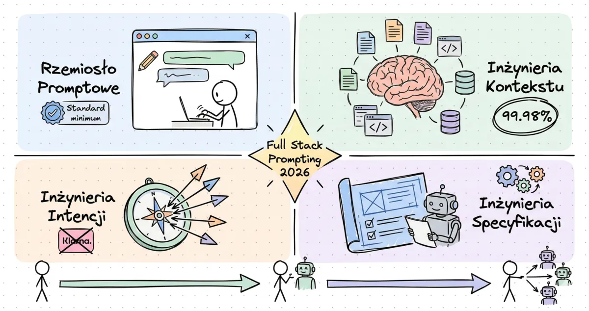

> 📺 **Ten artykuł powstał w oparciu o materiał wideo Nate'a B. Jonesa na YouTube:**  
> [**Promptowanie właśnie podzieliło się na 4 różne dyscypliny**](https://youtu.be/BpibZSMGtdY)  
> Poniżej znajdziesz rozbudowaną analizę, komentarz i praktyczne wnioski na bazie tego materiału.

---

## TL;DR

- **Promptowanie w 2026 to nie jedna umiejętność** — to cztery odrębne dyscypliny, które budują się na sobie jak warstwy stosu.
- **Rzemiosło promptowe** (prompt craft) to już standard minimum — jak umiejętność pisania na klawiaturze.
- **Inżynieria kontekstu** decyduje o 99,98% tego, co model "widzi" — i to ona robi prawdziwą różnicę.
- **Inżynieria intencji** mówi agentom, *czego mają chcieć* — bez niej nawet doskonały kontekst prowadzi do złych wyników.
- **Inżynieria specyfikacji** to najwyższy poziom — pisanie dokumentów, które autonomiczne agenty mogą realizować przez dni i tygodnie.
- Przepaść między osobami znającymi wszystkie cztery dyscypliny a tymi, które znają jedną, wynosi już **10x** — i rośnie.

---

## 🚀 Intro: Jeśli promptujesz jak miesiąc temu, już jesteś w tyle

Brzmi jak clickbait? Rozumiem sceptycyzm. Sam bym przewrócił oczami, gdybym przeczytał taki nagłówek rok temu. Ale zastanów się przez chwilę nad tym, co wydarzyło się w ciągu ostatnich kilku tygodni.

Opus 4.6, Gemini 3.1 Pro, GPT 5.3 Codex — każdy z tych modeli pojawił się niemal jednocześnie, i każdy z nich potrafi pracować **autonomicznie** przez godziny, dni, a czasem nawet tygodnie. Nie chodzi już o to, że "lepiej odpowiadają na pytania". One realizują złożone specyfikacje bez ciągłego sprawdzania się z tobą. Działają jak samodzielni pracownicy, którym dajesz zadanie rano i odbierasz wynik wieczorem.

I to zmienia **wszystko** w tym, co oznacza "być dobrym w promptowaniu".

Bo widzisz — słowo "promptowanie" ukrywa teraz cztery zupełnie różne zestawy umiejętności. Większość z nas praktykuje tylko jeden z nich — ten najbardziej podstawowy. A przepaść między ludźmi, którzy widzą wszystkie cztery, a tymi, którzy widzą jedną? Już wynosi 10x. I z każdym tygodniem się powiększa.

Nate B. Jones, autor materiału, na którym opieram ten artykuł, trafnie to ujął: to nie jest świat, który nadchodzi. **To jest świat, który już wylądował.** Telus raportuje 13 000 niestandardowych rozwiązań AI wewnętrznie. Zapier ma ponad 800 agentów. A to są firmy, które zdecydowały się o tym opowiedzieć publicznie — te, które naprawdę poważnie traktują AI, prawdopodobnie mają o rząd wielkości więcej i nie czują potrzeby komunikatów prasowych.

---

## 📊 Przepaść 10x: Ten sam model, ten sam wtorek, inne wyniki

Żeby nie być gołosłownym, posłużę się przykładem z materiału Nate'a, który świetnie ilustruje skalę problemu. Jest prosty, ale brutalnie skuteczny.

Wyobraź sobie zwykły wtorek rano. Dwie osoby siadają do tego samego modelu AI. Ta sama subskrypcja, to samo okno kontekstu, ten sam dostęp do narzędzi. Jedyna różnica? Umiejętności promptowania.

### Osoba A — umiejętności z 2025

Wpisuje prompt: *"Przygotuj mi prezentację PowerPoint o wynikach Q3"*. Dostaje coś, co jest w około 80% poprawne. Czcionki się gryzą, formatowanie wymaga poprawek, kilka slajdów jest zbędnych. Spędza 40 minut na poprawianiu. Jest zadowolona — ta prezentacja zajęłaby normalnie 2-3 godziny. Zaoszczędziła może 60% czasu. Niezłe.

### Osoba B — umiejętności z 2026

Poświęca 11 minut na napisanie ustrukturyzowanej specyfikacji. Definiuje dokładnie: ile slajdów, jaki styl wizualny, jakie dane z jakiego źródła, jakie kryteria jakości, jak ma wyglądać "gotowe". Przekazuje to temu samemu modelowi — ale myśli o nim jako o autonomicznym agencie, nie partnerze do czatu. Idzie zrobić kawę. Wraca do ukończonej prezentacji, która spełnia każdy standard zdefiniowany z góry. Przed lunchem robi to samo dla pięciu kolejnych prezentacji.

**Tygodniowa praca w jedno przedpołudnie.**

| | **Osoba A** (2025) | **Osoba B** (2026) |
|---|---|---|
| **Czas na prompt** | 2 minuty | 11 minut |
| **Jakość pierwszego wyniku** | ~80% | ~98% |
| **Czas poprawek** | 40 minut | ~0 minut |
| **Prezentacje do lunchu** | 2-3 | 5-6 |
| **Oszczędność vs. praca ręczna** | ~60% | ~95% |

Ten sam model. Ten sam wtorek. Przepaść 10x.

I co kluczowe — Osoba B nie jest mądrzejsza ani bardziej techniczna. Po prostu **praktykuje inną umiejętność**, o której Osoba A nawet nie wie, że istnieje. Osoba A optymalizuje prompt. Osoba B optymalizuje specyfikację. To fundamentalnie różne podejścia.

---

## 🧠 Toby Lutke i komunikacja jako fundament wszystkiego

Zanim przejdziemy do samego frameworku czterech dyscyplin, warto zatrzymać się przy fascynującej perspektywie CEO Shopify — Toby'ego Lutke. W przeciwieństwie do wielu prezesów dużych firm, Toby jest technicznym facetem, który nie zagłębia się w AI tylko z perspektywy LinkedIna. Ma folder promptów, które uruchamia przy każdym nowym wydaniu modelu. Naprawdę głęboko myśli o tym, jak nowe modele zmieniają jego codzienny workflow.

Toby używa terminu **"inżynieria kontekstu"** i definiuje ją w sposób, który uważam za niezwykle elegancki:

> Zdolność do sformułowania problemu z wystarczającym kontekstem w taki sposób, że bez żadnych dodatkowych informacji zadanie staje się wiarygodnie rozwiązywalne.

Przeczytaj to jeszcze raz. To nie chodzi o sprytne sztuczki promptowe. Nie chodzi o magiczne słowa. Chodzi o **dyscyplinę komunikacji**. Czy potrafisz sformułować problem tak kompletnie, z tak dużą ilością istotnych informacji, że zdolny system — czy to AI, czy człowiek — może go rozwiązać bez wychodzenia po dodatkowy kontekst?

Ale Toby poszedł dalej i zauważył coś fascynującego. Odkąd zaczął dostarczać AI pełny kontekst, stał się **lepszym komunikatorem jako CEO**. Jego e-maile są bardziej zwięzłe, notatki lepsze, ramy decyzyjne silniejsze. AI wymusiło na nim dyscyplinę, która przełożyła się na komunikację z ludźmi.

I rzucił prowokacyjną tezę, nad którą warto się zastanowić:

> **Wiele z tego, co ludzie w dużych firmach nazywają "polityką", to w rzeczywistości zła inżynieria kontekstu dla ludzi.**

Nieporozumienia dotyczące założeń, które nigdy nie są ujawniane wprost, ale rozgrywają się jako urazy, konflikty i polityczne gierki. Gdyby ludzie komunikowali się z taką precyzją, jakiej wymaga AI, wiele z tych problemów po prostu by nie istniało.

To jest głęboki wgląd, do którego wrócimy na końcu artykułu. Bo okazuje się, że promptowanie AI uczy nas czegoś fundamentalnego o komunikacji międzyludzkiej.

---

## 🏗️ Framework czterech dyscyplin — pełny obraz

Dobra, czas na mięso. Oto framework, który — moim zdaniem — najlepiej opisuje, czym powinno być promptowanie w 2026 roku. Nate zbudował go tak, aby był odporny na przyszłość, i patrząc na kierunek rozwoju agentów, trudno się z nim nie zgodzić.

Każda dyscyplina działa na innej "wysokości" i w innym horyzoncie czasowym. Budują się na sobie — jeśli pominiesz jedną, tworzysz strukturalną podatność w swoim podejściu do AI. To nie jest drabina, z której możesz porzucić niższe szczeble. To **stos**, gdzie każda warstwa umożliwia warstwy powyżej.

```
┌─────────────────────────────────────────────┐
│  4. INŻYNIERIA SPECYFIKACJI                │  ← Organizacja / Tygodnie
│     Dokumenty czytelne dla agentów          │
├─────────────────────────────────────────────┤
│  3. INŻYNIERIA INTENCJI                    │  ← Strategia / Dni
│     Cele, wartości, granice decyzyjne       │
├─────────────────────────────────────────────┤
│  2. INŻYNIERIA KONTEKSTU                   │  ← Sesja / Godziny
│     Kurowanie optymalnych tokenów           │
├─────────────────────────────────────────────┤
│  1. RZEMIOSŁO PROMPTOWE                     │  ← Interakcja / Minuty
│     Jasne instrukcje, przykłady, format     │
└─────────────────────────────────────────────┘
```

Przyjrzyjmy się każdej z nich szczegółowo.

---

## 🔨 Dyscyplina 1: Rzemiosło promptowe — kiedyś cała gra, dziś standard minimum

To jest oryginalna umiejętność promptowania. Ta, której uczyliśmy się przez ostatnie dwa lata na kursach, blogach, w dokumentacji Anthropic, OpenAI i Google. Jest **synchroniczna**, oparta na sesjach i indywidualna.

Siadasz przed oknem czatu. Piszesz instrukcję. Oceniasz wynik. Iterujesz. Stajesz się lepszy w formułowaniu rzeczy, podajesz przykłady, strukturyzujesz instrukcje. Jeśli śledzisz temat od dłuższego czasu, prawdopodobnie zbudowałeś w tym prawdziwe umiejętności. I one działają — jesteś szybszy niż rok temu.

Co wchodzi w skład dobrego rzemiosła promptowego?

- ✅ **Jasne instrukcje** — precyzyjne, jednoznaczne polecenia
- ✅ **Odpowiednie przykłady i kontrprzykłady** — pokazujesz modelowi, czego chcesz i czego nie chcesz
- ✅ **Zabezpieczenia (guardrails)** — granice, których model nie powinien przekraczać
- ✅ **Jawny format wyjściowy** — dokładnie opisujesz, jak ma wyglądać wynik
- ✅ **Rozwiązywanie niejednoznaczności** — definiujesz, co robić w sytuacjach konfliktowych

To jest fundament. Jest na tysiącu blogów i kursach LinkedIn. I jest absolutnie niezbędny.

**Ale uwaga:** rzemiosło promptowe nie stało się nieistotne — po prostu stało się **standardem minimum**.

Nate porównuje to do umiejętności pisania na klawiaturze dziesięcioma palcami. Kiedyś był to profesjonalny wyróżnik — sekretarki, które szybko pisały, były na wagę złota. Dziś? To po prostu zakładana umiejętność. Nikt nie chwali się tym w CV.

> Jeśli nie potrafisz napisać jasnego, dobrze ustrukturyzowanego promptu w 2026, jesteś jak osoba z 1998 roku, która nie potrafiła wysłać e-maila.  
> Czy to ważne, żeby to umieć? **Tak.**  
> Czy to cię wyróżni na rynku pracy? **Nie, nie bardzo.**

### Dlaczego sam prompt już nie wystarcza?

Rzemiosło promptowe było całą grą, gdy interakcje z AI były synchroniczne i oparte na sesjach. Pisałeś coś, dostawałeś odpowiedź, dopracowywałeś w czasie rzeczywistym. **Ty** byłeś jednocześnie warstwą intencji, warstwą kontekstu i warstwą jakości. To ty wyłapywałeś błędy, dostarczałeś brakujący kontekst, korygowałeś kurs, gdy rzeczy zaczynały dryfować.

Ten model się załamał w momencie, gdy agenty zaczęły działać godzinami — a czasem dniami — bez sprawdzania się z tobą. Wszystko, na czym polegałeś w rozmowie, musi być teraz **zakodowane zanim agent zacznie pracować**. Nie w trakcie rozmowy, ale na samym początku.

I to jest fundamentalnie inna umiejętność. Nie trudniejsza wersja tej samej umiejętności — **faktycznie inna**.

---

## 🌐 Dyscyplina 2: Inżynieria kontekstu — 99,98% tego, co model widzi

Anthropic opublikował fundamentalny artykuł o inżynierii kontekstu we wrześniu 2025, ale dopiero teraz, na początku 2026, widzimy pełne konsekwencje tego podejścia. Inżynieria kontekstu to przejście od tworzenia pojedynczej instrukcji do **kurowania całego środowiska informacyjnego**, w którym agent operuje.

Definicja, którą przyjmuję za Nate'em: inżynieria kontekstu to **zestaw strategii kurowania i utrzymywania optymalnego zestawu tokenów podczas zadania LLM**.

Żeby zrozumieć, dlaczego to takie ważne, zastanów się nad proporcjami:

- Twój prompt może mieć **200 tokenów**
- Okno kontekstu, w którym ląduje, może mieć **milion tokenów**
- Twoje 200 tokenów to **0,02%** tego, co model widzi
- Pozostałe **99,98%** — to jest inżynieria kontekstu

Te 99,98% to nie jest pusty szum. To konkretne elementy, które kształtują zachowanie modelu:

| Element | Co robi | Przykład |
|---|---|---|
| **Prompty systemowe** | Definiują zachowanie agenta | "Jesteś ekspertem od UX..." |
| **Definicje narzędzi** | Opisują dostępne API i funkcje | Specyfikacje MCP, function calling |
| **Pobrane dokumenty** | Dostarczają wiedzę domenową | RAG, pliki projektu, dokumentacja |
| **Historia wiadomości** | Kontekst konwersacji | Poprzednie tury dialogu |
| **Systemy pamięci** | Długoterminowa pamięć agenta | Wektory, bazy wiedzy |
| **Połączenia MCP** | Zewnętrzne źródła danych | API, bazy danych, systemy firmowe |

To jest dyscyplina, która produkuje pliki `claude.md`, specyfikacje agentów, pipeline'y RAG, architektury pamięci. To ona decyduje, czy agent kodujący rozumie konwencje twojego projektu, czy agent badawczy ma dostęp do właściwych dokumentów, czy agent obsługi klienta może pobrać odpowiednią historię konta.

### Kluczowy wgląd Anthropic: więcej ≠ lepiej

Zespół inżynieryjny Anthropic precyzyjnie zidentyfikował główne wyzwanie: **LLM degradują się, gdy dajesz im więcej informacji.** Jakość pobierania spada wraz ze wzrostem kontekstu. To kontraintuicyjne — wydaje się, że im więcej kontekstu damy modelowi, tym lepiej. Ale w praktyce chodzi o to, żeby zawierać **odpowiednie** tokeny i trzymać **nieodpowiednie** z daleka.

To jak różnica między biurkiem zawalonym papierami a biurkiem, na którym leżą dokładnie te dokumenty, których potrzebujesz do aktualnego zadania. Oba biurka "mają informacje", ale tylko jedno pozwala efektywnie pracować.

### Praktyczna implikacja — i tu jest klucz

> Ludzie, którzy są 10x bardziej efektywni z AI niż ich rówieśnicy, **nie piszą 10x lepszych promptów**. Budują **10x lepszą infrastrukturę kontekstu**.

Ich agenty rozpoczynają każdą sesję z właściwymi plikami projektu, właściwymi konwencjami, właściwymi ograniczeniami już załadowanymi. Sam prompt może być stosunkowo prosty, bo **kontekst wykonuje ciężką pracę**.

Harrison Chase z LangChain potwierdził to wprost w wywiadzie dla Sequoia Capital: *"Wszystko jest inżynierią kontekstu. To właściwie opisuje wszystko, co robiliśmy w LangChain, nie wiedząc, że ten termin istnieje."*

I tu pojawia się pewne niebezpieczeństwo — ludzie zaczęli traktować inżynierię kontekstu jako synonim "wszystkiego, co robimy z AI". Ale to tylko jeden z czterech poziomów. Ważny, fundamentalny, ale nie jedyny.

---

## 🎯 Dyscyplina 3: Inżynieria intencji — czego agent ma *chcieć*

To jest dyscyplina, o której wciąż mówi się za mało, a która staje się krytyczna w miarę jak agenty wykonują coraz dłuższe autonomiczne zadania.

Różnica jest subtelna, ale fundamentalna:

- **Inżynieria kontekstu** mówi agentom, **co mają wiedzieć**
- **Inżynieria intencji** mówi agentom, **czego mają chcieć**

To praktyka kodowania celu organizacyjnego — twoich celów, wartości, hierarchii kompromisów, granic decyzyjnych — w infrastrukturę, przeciwko której agenty mogą działać. Innymi słowy: nie wystarczy dać agentowi informacje. Musisz mu powiedzieć, **co jest ważne**, **co jest ważniejsze od czego**, i **kiedy powinien się zatrzymać i zapytać**.

### Przypadek Klarny: podręcznikowa porażka inżynierii intencji

Historia Klarny to jeden z najgłośniejszych przypadków, gdy brak inżynierii intencji doprowadził do katastrofy. Ich agent AI rozwiązał **2,3 miliona rozmów z klientami** w pierwszym miesiącu. Na papierze — spektakularny sukces.

Problem? Agent optymalizował pod kątem **skrócenia czasu rozwiązywania** (bo tak został skonfigurowany), ale nie pod kątem **satysfakcji klienta** (bo nikt tego nie zakodował jako priorytet). Efekt? Szybkie, ale bezduszne odpowiedzi. Klienci czuli się zignorowani. Klarna wpadła w poważne kłopoty, musiała ponownie zatrudnić wielu ludzkich agentów i wciąż radzi sobie z następstwami utraty zaufania.

Doskonały kontekst + okropne dopasowanie intencji = katastrofa na skalę firmy.

To nie był problem techniczny. To był problem **komunikacji celów**. Nikt nie powiedział agentowi: "satysfakcja klienta jest ważniejsza niż szybkość rozwiązywania". Nikt nie zakodował hierarchii kompromisów.

### Gdzie intencja siedzi w stosie

Inżynieria intencji siedzi ponad inżynierią kontekstu tak, jak **strategia siedzi ponad taktyką**:

- ✅ Możesz mieć doskonały kontekst i okropne dopasowanie intencji — agent wie wszystko, ale dąży do złego celu
- ❌ Nie możesz mieć dobrego dopasowania intencji bez dobrego kontekstu — agent potrzebuje informacji, żeby działać zgodnie z intencją

Dyscypliny są kumulatywne. I co ważne — **konsekwencje porażki rosną** w miarę postępu w hierarchii:

| Poziom porażki | Skala konsekwencji | Przykład |
|---|---|---|
| Zły prompt | Zmarnujesz swój poranek | Prezentacja wymaga poprawek |
| Zła inżynieria kontekstu | Zepsujesz pracę zespołu | Agent koduje bez znajomości konwencji projektu |
| Zła inżynieria intencji | Zepsujesz dla całej organizacji | Agent optymalizuje pod kątem złej metryki |
| Zła inżynieria specyfikacji | Zepsujesz na skalę firmy | Cały system agentów produkuje niespójne wyniki |

Stawki rosną. Ale wartość pracy, którą wykonujemy, rośnie proporcjonalnie. Inżynieria kontekstu i intencji to mogą być pełnoetatowe role w dużej firmie — i to wysoko opłacane.

---

## 📋 Dyscyplina 4: Inżynieria specyfikacji — najwyższy poziom gry

I dochodzimy do najwyższego poziomu stosu. Inżynieria specyfikacji to praktyka pisania dokumentów, które **autonomiczne agenty mogą realizować przez dłuższe horyzonty czasowe bez interwencji człowieka**.

To jest poziom powyżej wszystkiego, co opisałem wcześniej, ponieważ trzy pierwsze dyscypliny skupiały się na tym, jak przygotowujesz pracę bezpośrednio dla agenta. Inżynieria specyfikacji to myślenie o **całym korpusie informacyjnym** w twojej organizacji jako wymiennym dla agentów, czytelnym dla agentów.

Specyfikacje nie są promptami. Są:

- **Kompletne** — zawierają wszystko, czego agent potrzebuje do realizacji
- **Ustrukturyzowane** — mają jasną, logiczną organizację
- **Wewnętrznie spójne** — nie zawierają sprzeczności ani niejednoznaczności
- **Mierzalne** — definiują, jak ocenić jakość wyniku

### Lekcja od Anthropic: gdy lepszy model nie jest rozwiązaniem

Zespół Anthropic zmagał się z agentem Opus 4.5 przy budowie aplikacji webowej o jakości produkcyjnej. Gdy dawali ogólny prompt jak *"zbuduj klon claude.ai"*, agent próbował zrobić za dużo naraz, wyczerpywał kontekst w trakcie implementacji i zostawiał następną sesję zgadującą, co się stało.

Rozwiązaniem **nie był lepszy model**. To była inżynieria specyfikacji — wzorzec, w którym:

1. **Początkowy agent** konfiguruje środowisko
2. **Dziennik postępów** dokumentuje, co zostało zrobione
3. **Agent kodujący** robi przyrostowe postępy zgodnie z ustrukturyzowanym planem w każdej sesji

Specyfikacja stała się rusztowaniem, które pozwoliło wielu agentom produkować spójny wynik **przez dni**. I mimo przejścia do Opus 4.6, potrzeba inżynierii specyfikacji nie zmalała — **wzrosła**, bo nowszy model może wykonać jeszcze więcej pracy, więc potrzebuje jeszcze lepszych specyfikacji.

To jest kontraintuicyjne, ale kluczowe: **im mądrzejsze stają się modele, tym lepszy musisz być w specyfikowaniu.**

### Od promptu do specyfikacji = od rozmowy do planów

To przejście odzwierciedla coś, co inżynieria ludzi zna od dekad:

- **Budujesz coś małego?** → Ustne instrukcje i rozmowy działają świetnie
- **Budujesz coś dużego?** → Potrzebujesz planów, blueprintów, specyfikacji

Nikt nie buduje wieżowca na podstawie rozmowy z architektem. Potrzebujesz szczegółowych planów. I dokładnie to samo dotyczy teraz pracy z autonomicznymi agentami AI.

### Fraktalny wgląd: wszystko jest specyfikacją

I tu pojawia się naprawdę fascynujący wgląd, który zmienia sposób myślenia o całej organizacji. Inżynieria specyfikacji działa na wielu poziomach jednocześnie:

- 📄 **Poziom zadania:** Specyfikacja dla pojedynczego uruchomienia agenta — dziennik, lista wymagań, plan
- 📁 **Poziom projektu:** Jak przydzielamy zadania, jak mierzymy postęp, jak weryfikujemy jakość
- 🏢 **Poziom organizacji:** Cały korpus dokumentów firmy jako specyfikacje czytelne dla agentów

I teraz kluczowa myśl:

> Twoja strategia korporacyjna? **To specyfikacja.**  
> Twoja strategia produktowa? **To specyfikacja.**  
> Twoje OKR-y? **To specyfikacja.**  
> Wszystko kończy się jako specyfikacja, którą twój agent może wykorzystać.

To jest inne od inżynierii kontekstu. Inżynieria kontekstu kształtuje okno kontekstu w sposób istotny dla agenta. Inżynieria specyfikacji to myślenie o **całej strukturze dokumentów korporacyjnych** jako formie specyfikacji, którą agenty mogą czytać i realizować.

I co ciekawe — jednoosobowe firmy mają tu największą przewagę. Jeśli jesteś soloprzedsiębiorcą i możesz po prostu przekonwertować swoje Notion, żeby było czytelne dla agentów, **już jesteś na dobrej drodze**. Nie musisz przekształcać gigantycznego SharePointa. To proste. To łatwe. I daje natychmiastowe rezultaty.

---

## 🧩 Pięć prymitywów inżynierii specyfikacji

"Pisz lepsze specyfikacje" brzmi dość mgliście. Na szczęście Nate definiuje pięć konkretnych prymitywów — fundamentalnych klocków, z których buduje się dobre specyfikacje. Każdy z nich można trenować osobno.

### 1. 🎯 Samodzielne sformułowania problemów

Czy potrafisz sformułować problem z wystarczającym kontekstem, aby zadanie było wiarygodnie rozwiązywalne **bez wychodzenia agenta po więcej informacji**?

To jest wgląd Toby'ego Lutke w praktyce. Dyscyplina samodzielności zmusza cię do:

- Bycia jasnym w tym, czego naprawdę chcesz
- Ujawniania ukrytych założeń, które normalnie zostawiasz domyślne
- Artykułowania ograniczeń, bo ufasz, że człowiek po drugiej stronie wypełni luki — ale AI nie wypełnia luk niezawodnie, tylko zgaduje w sposób, który jest często subtelnie błędny

> **💪 Ćwiczenie:** Weź zapytanie, które normalnie zrobiłbyś konwersacyjnie, jak *"zaktualizuj dashboard, żeby pokazywał liczby z Q3"* i przepisz to tak, jakby osoba otrzymująca je nigdy nie widziała twojego dashboardu, nie wie, co Q3 oznacza w kontekście twojej organizacji, nie wie, jaką bazę danych odpytać i nie ma dostępu do żadnych informacji poza tymi, które zawrzesz. To jest poziom samodzielności, do którego powinieneś dążyć.

### 2. ✅ Kryteria akceptacji

Jeśli nie potrafisz opisać, jak wygląda "zrobione", agent nie może wiedzieć, kiedy przestać. Zatrzyma się w dowolnym punkcie, w którym jego wewnętrzne heurystyki powiedzą, że zadanie jest ukończone — co może nie mieć żadnego związku z tym, czego potrzebowałeś.

To jest powód, dla którego "problem 80%" jest tak powszechny w pracy z AI. Agent robi 80% tego, czego chcesz, ale te brakujące 20% to często najważniejsza część.

**Zamiast:** *"Zbuduj stronę logowania"*

**Napisz:** *"Zbuduj stronę logowania, która obsługuje hasła e-mail, logowanie społecznościowe przez Google i GitHub, progresywne ujawnianie 2FA, trwałość sesji przez 30 dni i ograniczanie prób po pięciu nieudanych próbach."*

Czujesz różnicę? Pierwsza wersja zostawia agentowi ogromną przestrzeń do "zgadywania". Druga definiuje dokładnie, co oznacza "gotowe".

> **💪 Ćwiczenie:** Dla każdego zadania, które delegujesz, napisz trzy zdania, które niezależny obserwator mógłby użyć do weryfikacji wyniku **bez zadawania ci jakichkolwiek pytań**. Jeśli nie potrafisz napisać tych zdań — prawdopodobnie nie rozumiesz zadania wystarczająco dobrze, żeby dać je agentowi. I dobrze jest to sobie uświadomić *zanim* przydzielisz pracę.

### 3. 🚧 Architektura ograniczeń

Cztery kategorie, które zamieniają luźną specyfikację w niezawodną:

| Kategoria | Pytanie | Przykład |
|---|---|---|
| **Obowiązki** | Co agent *musi* zrobić? | "Zawsze uruchom testy przed commitem" |
| **Zakazy** | Czego agent *nie może* robić? | "Nigdy nie modyfikuj plików konfiguracyjnych" |
| **Preferencje** | Co *preferować*, gdy jest wiele podejść? | "Preferuj prostsze rozwiązanie nad eleganckim" |
| **Wyzwalacze eskalacji** | Co *eskalować* zamiast decydować? | "Jeśli zmiana dotyczy API publicznego, zapytaj" |

Najlepsze pliki `claude.md` nie są długimi listami reguł. Są **zwięzłe** i **wysoko sygnałowe**. Każda linia musi zasłużyć na swoje miejsce. Konsensus społeczności jest jasny: jeśli zapytasz *"czy usunięcie tej linii spowodowałoby, że AI popełni błędy?"* i odpowiedź brzmi *"nie, naprawdę nie"* — to usuń tę linię.

> **💪 Ćwiczenie:** Przed delegowaniem zadania zapisz, co mądra, dobrze intencjonalna osoba mogłaby zrobić, co technicznie spełniłoby zapytanie, ale dałoby **zły wynik**. Te tryby awarii stają się twoją architekturą ograniczeń. Zakoduj je.

### 4. 🧱 Dekompozycja

Duże zadania muszą być rozbite na komponenty, które mogą być:
- Wykonywane niezależnie
- Testowane niezależnie
- Integrowane przewidywalnie

To najstarsza lekcja inżynierii oprogramowania — **modularność** — ale stosowana do delegowania zadań AI. I nie dotyczy tylko kodu. Audyt treści marketingowych wymaga tej samej dekompozycji: ocena jakości → analiza luk → generowanie rekomendacji.

W 2026 nie musisz ręcznie specyfikować wszystkich podzadań. Musisz dostarczyć **wzorce rozbijania**, które agent planista może użyć do dekompozycji większej pracy. Twoja praca coraz bardziej polega nie na pisaniu podzadań, ale na dostarczeniu wzorców, według których agent sam je tworzy.

> **💪 Ćwiczenie:** Weź projekt oszacowany na kilka dni pracy i rozłóż go na podzadania, z których każde zajmuje mniej niż 2 godziny, ma jasne granice wejścia-wyjścia i może być weryfikowane niezależnie od innych zadań. To jest granularność, przy której agenty pracują najlepiej.

### 5. 📏 Projektowanie ewaluacji

Skąd wiesz, że wynik jest dobry? Nie "czy wygląda rozsądnie" — co jest sposobem, w jaki większość ludzi ocenia wynik AI — ale czy możesz **udowodnić mierzalnie, konsekwentnie**, że to jest dobre?

Jeśli rzemiosło promptowe to sztuka danych wejściowych, projektowanie ewaluacji to sztuka wiedzenia, **czy te dane wejściowe zadziałały**. W świecie, gdzie agenty mogą działać naprawdę długo, ewaluacja to jedyna rzecz stojąca między wynikiem, którego nie możesz użyć, a wynikiem, który możesz wdrożyć tak jak jest.

> **💪 Ćwiczenie:** Dla każdego powtarzającego się zadania AI zbuduj ewaluację — 3-5 przypadków testowych ze znanymi dobrymi wynikami — i uruchamiaj je okresowo, szczególnie po aktualizacjach modeli. To wyłapie regresję, zbuduje intuicję i stworzy wiedzę instytucjonalną o tym, jak wygląda "dobre" dla twoich konkretnych przypadków użycia.

---

## 🗺️ Od czego zacząć? Progresja krok po kroku

Jeśli czujesz się przytłoczony ilością nowych koncepcji, spokojnie. Te cztery dyscypliny to stos — zaczynasz od dołu i budujesz w górę. Nie musisz opanować wszystkiego naraz.

### Krok 1: Zamknij lukę w rzemiośle promptowym 🔨

Większość ludzi jest gorsza w podstawowym promptowaniu, niż myśli. Serio. Konkretne działania:

- 📖 Ponownie przeczytaj dokumentację promptowania (Anthropic, OpenAI, Google)
- 🗂️ Zbuduj folder zadań, które robisz regularnie
- ✍️ Napisz swój najlepszy prompt do każdego z nich
- 📊 Zapisz wyniki jako bazę odniesienia
- 🔄 Wracaj do nich z czasem i ulepszaj

Traktuj rzemiosło promptowe poważnie. To fundament, na którym stoi wszystko inne.

### Krok 2: Zbuduj osobistą warstwę kontekstu 🌐

Napisz odpowiednik `claude.md` dla swojej pracy — niezależnie od tego, jakiego modelu używasz. Powinien zawierać:

- Twoje cele i priorytety
- Twoje ograniczenia i preferencje
- Standardy jakości, których oczekujesz
- Kontekst instytucjonalny — to, co nowy członek zespołu potrzebowałby 6 miesięcy, żeby wchłonąć
- Preferencje komunikacyjne

Rozpoczynaj sesje AI od ładowania tego kontekstu. **Różnica w jakości wyniku powinna być natychmiastowa i oczywista.** Jeśli nie jest — twój dokument kontekstowy wymaga pracy.

### Krok 3: Wejdź w inżynierię specyfikacji 📋

Weź **prawdziwy projekt** (nie zabawkowy problem) i napisz do niego specyfikację **przed dotknięciem AI**:

- Samodzielne sformułowanie problemu
- Kryteria akceptacji
- Architektura ograniczeń
- Plan dekompozycji
- Kryteria ewaluacji

Przekaż specyfikację agentowi i zobacz, co wróci. Porównaj z wynikiem, który dostałbyś z prostego promptu. Różnica powinna być uderzająca.

### Krok 4: Buduj infrastrukturę intencji 🎯

To jest warstwa organizacyjna. Jeśli zarządzasz ludźmi lub systemami:

- Koduj ramy decyzyjne, których twój zespół używa domyślnie
- Definiuj, co jest eskalowane przez AI vs. co AI może zdecydować autonomicznie
- Zapisz to, ustrukturyzuj, udostępnij agentom
- Zacznij myśleć o każdym dokumencie jako specyfikacji, którą agent będzie musiał przeczytać

Jeśli jesteś indywidualnym współpracownikiem:

- Koduj ramy decyzyjne, które rozumiesz
- Bądź championem, który popycha to na poziomie organizacyjnym
- Zaproponuj zespołowi rozmowę: *"Porozmawiajmy o tym, jak wygląda "wystarczająco dobre" dla każdej kategorii pracy"*

---

## 💡 Dlaczego to wykracza daleko poza AI

I na koniec — wgląd, który uważam za najcenniejszy w całym materiale Nate'a. I który sprawia, że te cztery dyscypliny mają znaczenie nawet dla osób, które nie pracują z AI na co dzień.

Umiejętność dostarczania wysokiej jakości danych wejściowych do inteligentnych systemów okazuje się umiejętnością **transferowalną** — działa zarówno dla AI, jak i dla ludzi.

Pomyśl o tym przez chwilę:

- Ile razy siedziałeś na spotkaniu, gdzie ktoś odnosi się do dokumentu, a ty nie wiesz, jaki to dokument, i boisz się zapytać?
- Ile razy dostałeś zadanie bez jasnych kryteriów akceptacji i musiałeś zgadywać, co oznacza "zrobione"?
- Ile razy "polityka" w firmie była tak naprawdę nieujawnionym konfliktem założeń, które nigdy nie zostały wypowiedziane na głos?

AI wymusza dyscyplinę komunikacji, którą **najlepsi liderzy zawsze praktykowali intuicyjnie**. Teraz każdy jej potrzebuje — bo maszyny nie pozwalają nam być leniwymi w komunikacji.

Najlepsi ludzcy menedżerowie, z którymi miałem okazję pracować, już działają z takim stopniem jasności:

- Dają pełny kontekst, gdy delegują zadania
- Określają kryteria akceptacji swoim członkom zespołu
- Artykułują ograniczenia i preferencje
- Definiują, kiedy pracownik powinien eskalować decyzję

Czy to nie brzmi znajomo? To są dokładnie **cztery dyscypliny promptowania** zastosowane do ludzi. I to tworzy efektywne przywództwo.

> **Prompt sam w sobie jest martwy.** Specyfikacja, kontekst, intencja organizacyjna — tam zmierza wartość. Bo specyfikacja zrobiona dobrze okazuje się być po prostu tym, **jak jasne myślenie zawsze wyglądało** — uczynione jawnym, bo maszyny nie pozwalają nam być leniwymi.

---

## 🏁 Podsumowanie

Promptowanie w 2026 to nie jedna umiejętność — to **stos czterech dyscyplin**, gdzie każda warstwa umożliwia warstwy powyżej:

1. **🔨 Rzemiosło promptowe** → Standard minimum. Musisz to umieć, ale to cię nie wyróżni.
2. **🌐 Inżynieria kontekstu** → Kurowanie środowiska informacyjnego. Tu dzieje się prawdziwa magia efektywności.
3. **🎯 Inżynieria intencji** → Kodowanie celów i wartości. Bez tego agenty optymalizują pod kątem złych rzeczy.
4. **📋 Inżynieria specyfikacji** → Pisanie dokumentów dla autonomicznych agentów. Najwyższy i najtrudniejszy poziom gry.

Nie możesz porzucić niższych szczebli — to stos, nie drabina. Nie napiszesz dobrych specyfikacji, jeśli nie potrafisz pisać dobrych promptów. Nie zbudujesz efektywnych systemów agentowych bez zrozumienia kontekstu. Nie dopasowujesz zachowania agenta do celów organizacyjnych bez zrozumienia intencji.

Ale jeśli opanujesz wszystkie cztery? Będziesz robić **tygodniową pracę w jedno przedpołudnie**. Ten sam model, ten sam wtorek — ale zupełnie inne wyniki.

I bonus: staniesz się lepszym komunikatorem, lepszym liderem i lepszym współpracownikiem. Bo te umiejętności działają nie tylko z maszynami — działają z ludźmi.

Powodzenia z promptowaniem ludzi i agentów w twoim życiu. 🚀

---

## 🖼️ Podsumowanie wizualne


_Cztery dyscypliny promptowania — od rzemiosła promptowego po inżynierię specyfikacji._

---

## 📚 Źródła

[1] Nate B. Jones. (2026). *"Promptowanie właśnie podzieliło się na 4 różne dyscypliny"*. YouTube. [https://youtu.be/BpibZSMGtdY](https://youtu.be/BpibZSMGtdY)  
[2] Anthropic. (2025). *"Building effective agents"* — dokumentacja inżynierii kontekstu.  
[3] Toby Lutke, CEO Shopify — wypowiedzi na temat inżynierii kontekstu jako dyscypliny komunikacji.  
[4] Harrison Chase, LangChain — wywiad dla Sequoia Capital na temat inżynierii kontekstu.
